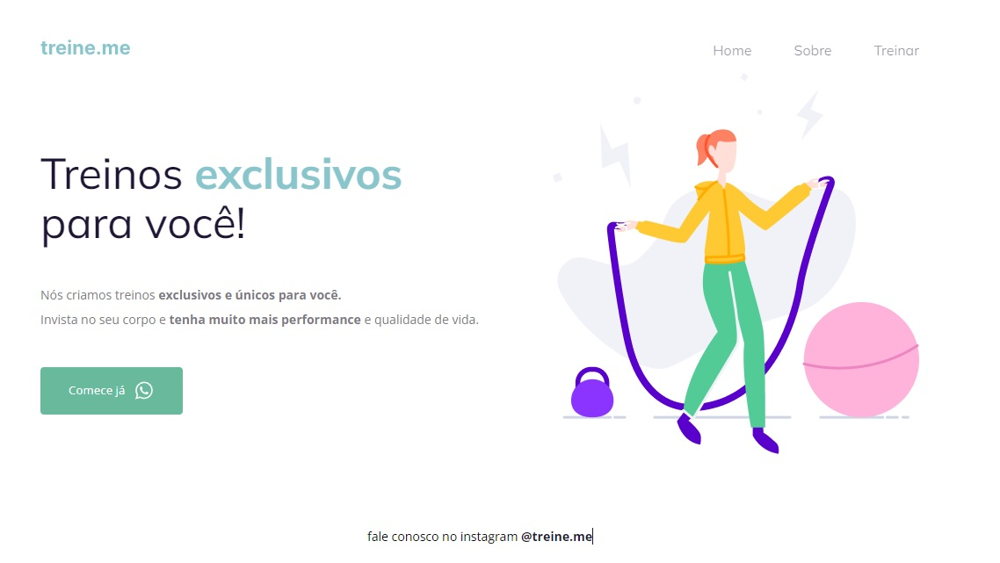

# desafio02-corrigindoBugs

<h1 align="center"> treine.me </h1>

O projeto treine.me foi desenvolvido durante o stage 02 no Explorer da Rocketseat. Esse projeto trata-se de um desafio para corrigir bugs que foram desenvolvidos no projeto do Stage02. 

  

## 🚀 Tecnologias

Esse projeto foi desenvolvido com as seguintes tecnologias:

- HTML e CSS
- Git e Github
- Figma

[Acesse o projeto finalizado, online](https://marcelgava.github.io/desafio02-corrigindoBugs/)
